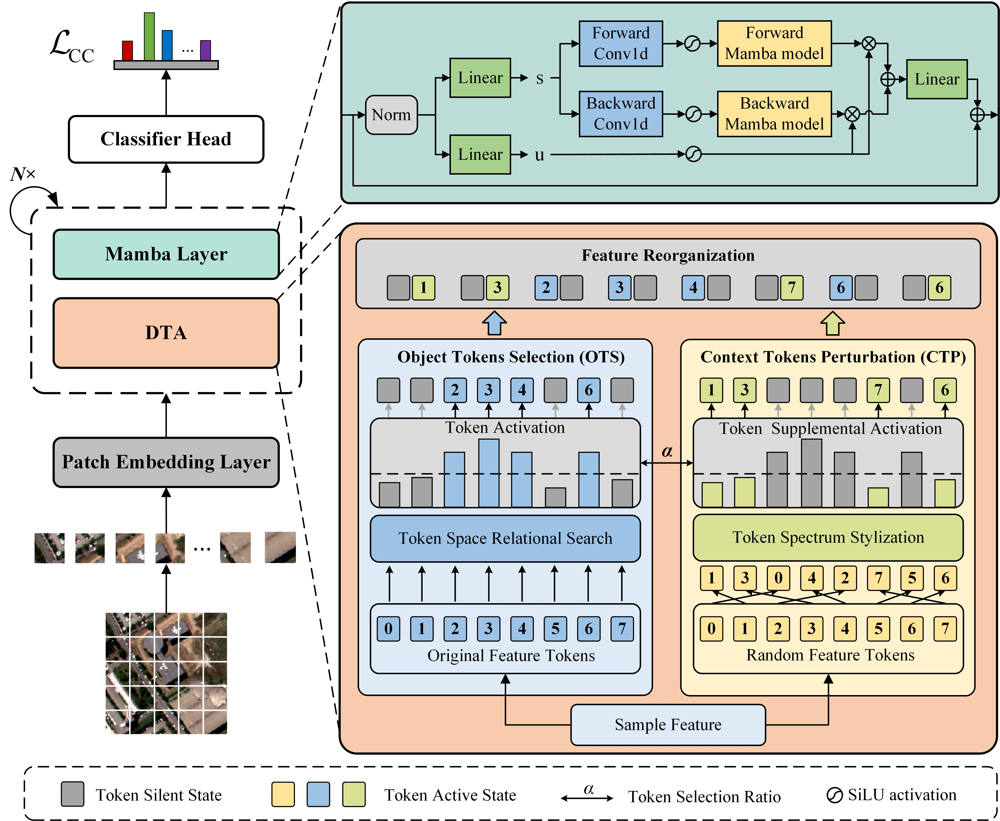

# DTAM
# Dynamic Token Augmentation Mamba for Cross-Scene Classification of Hyperspectral Image (TGRS2024)



# Abstract:
Cross-scene classification of hyperspectral image (HSI) based on single-source domain generalization (SDG) focuses on developing a model that can effectively classify images from unseen target domains using only source domain images, without the need for retraining. Most existing SDG approaches for cross-scene classification rely on convolutional neural networks (CNNs). However, the convolutional kernel operation causes the model to emphasize local object features, which can lead to overfitting on the source domain and limits its ability to generalize. Recently, methods based on the state space model have demonstrated excellent performance in image classification by capturing global features across different image patches. Building on this inspiration, we propose a novel approach called dynamic token augmentation mamba (DTAM), which aims to explore the potential of state space models in the cross-scene classification of HSI. The method gradually focuses on the global features of the image by constructing hidden states for HSIs unfolded into long sequences. To further enhance the global features of HSIs, we design a dynamic token augmentation module to transform the sample features by perturbing the contextual information while preserving the object information tokens. Additionally, we introduce a loss of classified compensation combined with labels of random samples to suppress the excessive narrowing of the feature range learned by the model. Comprehensive extensive experiments on three publicly available HSI datasets show that the proposed method outperforms the state-of-the-art (SOTA) method.

# Dataset:
The dataset can be downloaded from here: [HSI datasets](https://github.com/YuxiangZhang-BIT/Data-CSHSI). We greatly appreciate their outstanding contributions.

The dataset directory should look like this:
```
datasets
  Houston
  ├── Houston13.mat
  ├── Houston13_7gt.mat
  ├── Houston18.mat
  └── Houston18_7gt.mat
  Pavia
  ├── paviaU.mat
  ├── paviaU_7gt.mat
  ├── paviaC.mat
  └── paviaC_7gt.mat

```
